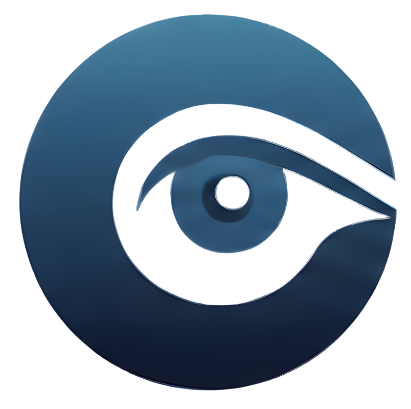

# Welcome to Oversight

**Oversight** is a unified enterprise data observability platform that leverages proven open-source components already running in 10,000+ enterprise environments.

<div style={{ display: 'flex', justifyContent: 'center', margin: '2rem 0' }}>
  
</div>

## What is Oversight?

Oversight eliminates the complexity of managing disparate observability tools by providing a **single, unified platform** for enterprise data operations. Built on battle-tested open-source components, Oversight delivers:

- **Complete visibility** into your data ecosystem
- **Unified authentication** across all services
- **Scalable storage** for observability data
- **AI/LLM monitoring** for modern applications
- **Enterprise-grade security** and compliance

Instead of juggling multiple vendors and integration points, Oversight provides a cohesive solution that your team can deploy, customize, and scale with confidence.

## Why Oversight?

Instead of managing siloed tools, Oversight delivers **unified control** through a carefully integrated stack of best-in-class open-source solutions:

- 🗂️ **DataHub** - Modern metadata management and data catalog
- 👁️ **Langfuse** - LLM observability and analytics
- 💾 **MinIO** - High-performance object storage
- 🔐 **Keycloak** - Enterprise-grade authentication and authorization

## Key Benefits

### 🚀 Proven at Scale
Each component is battle-tested in thousands of enterprise environments, providing reliability you can trust. These aren't experimental tools—they're production-grade platforms used by Fortune 500 companies.

### 🎯 Unified Control
Say goodbye to context switching between different tools. Oversight provides a single integrated platform instead of managing multiple disconnected tools, with consistent authentication and shared storage.

### 💰 Cost-Effective
100% open-source stack means no vendor lock-in, no per-seat licensing, and no surprise bills. Deploy on your infrastructure or cloud provider of choice.

### 🔒 Enterprise-Ready
Built-in authentication (Keycloak), security, and compliance features from day one. Meets the security requirements of regulated industries.

### 🔧 Fully Customizable
Open-source means you can customize, extend, and integrate Oversight to fit your exact needs. No waiting for vendor feature requests.

### 📊 Complete Observability
From data catalogs to LLM traces, Oversight covers the full spectrum of modern data observability needs in one platform.

## How It Works

Oversight integrates four complementary platforms:

1. **Keycloak** provides centralized authentication—users log in once to access all services
2. **MinIO** serves as the unified storage layer for all observability data
3. **DataHub** catalogs your data assets and tracks lineage across your organization
4. **Langfuse** monitors and optimizes your LLM applications in real-time

All components work together seamlessly, sharing authentication and storage, while maintaining their individual strengths.

## Quick Start

Get started with Oversight in minutes:

```bash
# Install DataHub
python3 -m pip install --upgrade acryl-datahub
datahub docker quickstart

# Clone and setup Langfuse
git clone https://github.com/langfuse/langfuse
cd langfuse
docker compose up

# Start Keycloak
docker run -d -p 8080:8080 --name keycloak \
  -e KEYCLOAK_ADMIN=admin \
  -e KEYCLOAK_ADMIN_PASSWORD=admin \
  quay.io/keycloak/keycloak:26.5.2 start-dev
```

## Use Cases

### Data Governance & Discovery
Catalog all your data assets, track lineage, enforce data quality standards, and ensure compliance with regulations like GDPR and CCPA.

### LLM Application Monitoring
Monitor costs, latency, and quality of your AI applications. Debug issues in production and optimize prompts based on real usage data.

### Multi-Cloud Data Operations
Manage data across multiple cloud providers with consistent tooling. MinIO provides S3-compatible storage anywhere.

### Enterprise Data Platform
Build a complete data platform for analytics, ML, and AI workloads with built-in observability and governance.

## What's Inside?

Oversight integrates four powerful open-source platforms:

### DataHub - Data Catalog & Governance
Modern metadata management platform that streamlines data discovery, lineage tracking, and governance. Know what data you have, where it came from, and how it's being used.

**Key Features:**
- Search across all data assets
- Visual lineage graphs
- Data quality monitoring
- Business glossary
- Access control integration

### Langfuse - LLM Observability
Complete observability for your LLM applications with tracing, monitoring, and analytics. Understand costs, identify bottlenecks, and improve quality.

**Key Features:**
- Trace every LLM call
- Cost tracking per user/model
- Prompt version management
- Quality scoring
- Dataset management

### MinIO - Object Storage
High-performance S3-compatible object storage for all your data needs. Store traces, datasets, models, and artifacts with enterprise-grade reliability.

**Key Features:**
- S3 API compatibility
- Encryption at rest and in transit
- Erasure coding for durability
- Distributed architecture
- Multi-tenancy support

### Keycloak - Authentication & Authorization
Enterprise-grade identity and access management with SSO, RBAC, and more. One login for all Oversight services.

**Key Features:**
- Single Sign-On (SSO)
- Social login support
- LDAP/AD integration
- Fine-grained permissions
- Multi-factor authentication

## Next Steps

- [**Getting Started →**](./getting-started)  
  Complete installation guide for all components

- [**Components Overview →**](./components/datahub)  
  Deep dive into each component of the stack

- [**Integration Guides →**](./guides/keycloak)  
  Step-by-step guides for integrating all components

- [**About Oversight →**](./about)  
  Learn about our mission and architecture

## Join the Community

Oversight builds on the vibrant communities of its component projects:

- [DataHub Slack](https://datahubspace.slack.com/) - 10K+ members
- [Langfuse Discord](https://langfuse.com/discord) - Active community
- [Keycloak Community](https://www.keycloak.org/community) - Industry standard
- [MinIO Slack](https://slack.min.io/) - 40K+ GitHub stars

